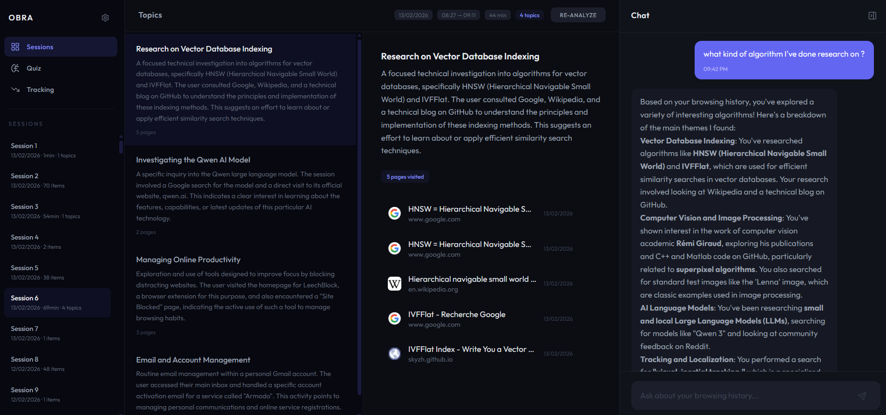

# Obra

> Intelligent learning assistant — Remember everything you explore on the web

**Status:** Work in Progress

## What is this?

A Chrome extension that turns your browsing history into a **learning tool**. It automatically organizes your navigation into thematic sessions, lets you chat with your history through an AI companion, and — soon — will help you **retain knowledge** using spaced repetition based on the Ebbinghaus forgetting curve.

Browse normally. Obra silently collects, clusters, and indexes everything. When you need to recall something, just ask.

## Features

- **Automatic session detection** — Groups browsing activity into sessions based on time gaps, analyzed in the background
- **AI-powered clustering** — Organizes pages by theme (work, research, hobbies...) using LLM analysis + embeddings
- **Semantic search** — Two-stage retrieval: finds relevant clusters first, then individual pages within them
- **Agentic chat** — Multi-step conversational interface with native tool calling; the assistant can search your history, filter by date/domain, and chain reasoning across multiple steps
- **Monitoring** — Built-in request tracing, LLM cost tracking, and a `/metrics` endpoint

### Coming next

- **Topic tracking** — Visualize how long since you revisited a subject, with forgetting curve graphs and smart reminders
- **Quiz & flashcards** — Auto-generated from your browsing content, triggered when a topic is fading from memory

## Demo


This screenshot demonstrates how the history data processing backbone enables the extraction of relevant semantic information from sparse and noisy history. This stands as the prerequisite for the upcoming features that will provide differentiation for this application.

## Quick Start
(So far, the application is not easily deployable, a future goal is to allow it to run locally on everyone's laptop (without sharing the history data on any server))

### Prerequisites

- Docker & Docker Compose
- Node.js 18+
- Chrome browser
- Google AI API key ([get one free](https://aistudio.google.com/apikey))

### Installation

1. **Clone & configure**

```bash
git clone https://github.com/your-username/obra.git
cd obra
cp env.template .env
# Edit .env and add your GOOGLE_API_KEY
```

2. **Start the backend**

```powershell
./scripts/dev_up.ps1
```

Or manually: `docker-compose up --build -d`

3. **Build the frontend**

```bash
cd frontend && npm install && npm run build
```

4. **Load the extension** — `chrome://extensions/` → Developer mode → Load unpacked → select `extension/`

5. **Verify** — http://localhost:8000/health

## Architecture

```
Chrome Extension (MV3)
├── Background worker ── collects history, derives sessions, triggers analysis
├── React Dashboard ──── 3-column layout (sidebar / content / chat)
│
└──► FastAPI Backend
     ├── Clustering Service ── LLM + embedding assignment
     ├── Chat Service ──────── agentic loop with tool calling
     ├── Search Service ────── two-stage semantic search (pgvector)
     ├── LLM Providers ────── Google, OpenAI, Anthropic, Ollama
     ├── Monitoring ────────── structured logging, request tracing, cost tracking
     │
     └──► PostgreSQL + pgvector (768-dim embeddings, HNSW indexes)
```

## Project Structure

```
obra/
├── extension/              # Chrome extension (MV3)
│   ├── background.js       # Service worker
│   ├── services/           # Auth, history, session, API services
│   ├── utils/              # Preprocessing, session utilities
│   └── dashboard-assets/   # Built React dashboard
├── frontend/src/           # React + TypeScript + Tailwind
│   ├── features/           # sessions, chat, quiz, tracking
│   ├── stores/             # Zustand state (sessions, chat, UI)
│   └── layouts/            # AppLayout, Sidebar
├── backend/app/
│   ├── services/           # Clustering, chat, search, LLM providers
│   ├── tools/              # Chat tool definitions (search_history, ...)
│   ├── models/             # Pydantic, SQLAlchemy, tool models
│   ├── repositories/       # Database access (repository pattern)
│   ├── monitoring/         # Metrics, decorators, structured logging
│   └── middleware/         # Request tracing
├── scripts/                # Dev utilities
└── docker-compose.yml
```

## Configuration

Key environment variables (see `env.template` for full list):

| Variable | Required | Description |
|----------|----------|-------------|
| `GOOGLE_API_KEY` | Yes | Google AI API key for Gemini & embeddings |
| `DEFAULT_PROVIDER` | No | LLM provider (`google`, `openai`, `anthropic`, `ollama`) |
| `DEFAULT_MODEL` | No | Model to use (default: `gemini-2.5-pro`) |
| `POSTGRES_USER` | No | Database user (default: `postgres`) |
| `POSTGRES_PASSWORD` | No | Database password (default: `postgres`) |

## Tech Stack

- **Extension:** Chrome MV3, vanilla JS services
- **Frontend:** React, TypeScript, Vite, Tailwind CSS, Zustand
- **Backend:** FastAPI, SQLAlchemy, pgvector, structured JSON logging
- **LLM:** Provider-agnostic (Google Gemini, OpenAI, Anthropic, Ollama)
- **Database:** PostgreSQL with pgvector (HNSW indexes)
