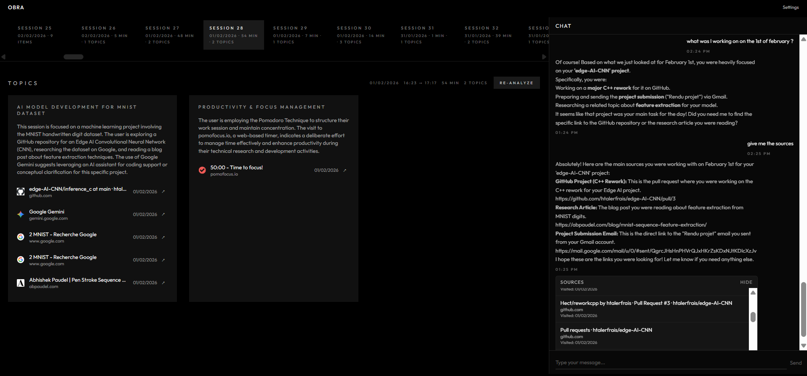

# Obra

> Intelligent browsing assistant — Never lose track of your research again

**Status:** Work in Progress (v0.9)

## What is this?

A Chrome extension that acts as your intelligent navigation assistant. It helps you close tabs without worry by automatically organizing your browsing history into thematic clusters (work, hobbies, research, etc.) and making them easily accessible through a dashboard.

Think of it as a smart memory for your browsing sessions—everything you've explored is preserved, organized, and ready to chat about.

## Features

- **Automatic session detection** : Groups browsing activity into sessions based on time gaps
- **AI-powered clustering** : Organizes pages by theme using LLM analysis
- **Semantic search** : Find past pages by meaning, not just keywords
- **Conversational interface** : Chat with your browsing history naturally

## Demo



*The dashboard automatically clustered a browsing session into "AI Model Development" and "Productivity & Focus Management" themes. On the right, the chat interface retrieves forgotten context: the user asks "what was I working on?" and the assistant finds the exact GitHub PR, research articles, and email threads from that day — with direct links to each source.*

## Quick Start

### Prerequisites

- Docker & Docker Compose
- Node.js 18+
- Chrome browser
- Google AI API key ([get one free](https://aistudio.google.com/apikey))

### Installation

1. **Clone the repository**
   ```bash
   git clone https://github.com/your-username/obra.git
   cd obra
   ```

2. **Configure environment**
   ```bash
   cp env.template .env
   # Edit .env and add your GOOGLE_API_KEY
   ```

3. **Start the backend**
   ```powershell
   ./scripts/dev_up.ps1
   ```
   Or manually:
   ```bash
   docker-compose up --build -d
   ```

4. **Build the frontend**
   ```bash
   cd frontend
   npm install
   npm run build
   ```

5. **Load the extension in Chrome**
   - Go to `chrome://extensions/`
   - Enable "Developer mode"
   - Click "Load unpacked"
   - Select the `extension/` folder

6. **Verify installation**
   - Backend health: http://localhost:8000/health
   - Click the extension icon in Chrome

## Architecture

```
Chrome Extension ──► FastAPI Backend ──► PostgreSQL
      │                    │
      │                    ├── LLM Service (Google Gemini)
      │                    └── Embedding Service (text-embedding-004)
      │
      └── React Dashboard (built into extension)
```

The extension collects browsing history in real-time, groups it into sessions, and sends completed sessions to the backend for AI-powered clustering. Results are cached in PostgreSQL with vector embeddings for semantic search.

## Project Structure

```
obra/
├── extension/           # Chrome extension (MV3)
│   ├── background.js    # Service worker
│   ├── services/        # Extension services (auth, history, session)
│   ├── dashboard-assets/# Built React dashboard
│   └── manifest.json
├── frontend/            # React dashboard source
│   └── src/
├── backend/             # FastAPI server
│   └── app/
│       ├── services/    # Clustering, chat, search, LLM providers
│       ├── models/      # Pydantic & SQLAlchemy models
│       └── repositories/# Database access
├── scripts/             # Dev utilities
└── docker-compose.yml
```

## Configuration

Key environment variables (see `env.template` for full list):

| Variable | Required | Description |
|----------|----------|-------------|
| `GOOGLE_API_KEY` | Yes | Google AI API key for Gemini & embeddings |
| `DEFAULT_PROVIDER` | No | LLM provider (`google`, `openai`, `anthropic`, `ollama`) |
| `DEFAULT_MODEL` | No | Model to use (default: `gemini-2.5-pro`) |
| `POSTGRES_USER` | No | Database user (default: `postgres`) |
| `POSTGRES_PASSWORD` | No | Database password (default: `postgres`) |

## Tech Stack

- **Extension:** Chrome MV3, vanilla JS services
- **Frontend:** React, TypeScript, Vite, Tailwind CSS
- **Backend:** FastAPI, SQLAlchemy, pgvector
- **Database:** PostgreSQL with vector extensions

## Next improvements :

### v2.0 
- [ ] Improve tool calling in the Chat, allow multiple tool calls and multi steps reflexion 
- [ ] Make the RAG retrieval more flexible, not only retrieving from closest clusters but also samples closest objects
- [ ] Improve system prompts
- [ ] Improve UX and session navigation

### v2.0 — Learning Assistant
- [ ] Smart reminders to revisit important topics
- [ ] Spaced repetition integration
- [ ] Auto-generated flashcards from browsing content
- [ ] Knowledge retention tracking
